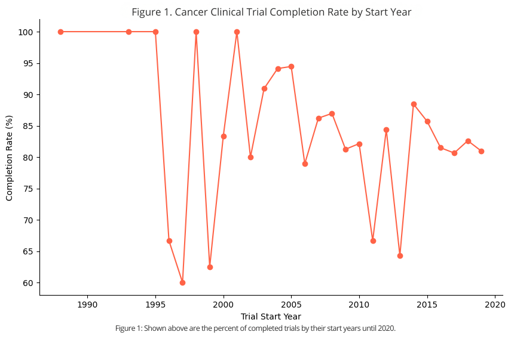

# <a name="press-release_project">Predicting Clinical Trial Completion Could Improve Cancer Research Funding Efficiency.</a>

## Hook:
With incomplete cancer clinical trials representing lost time, funding, and delayed treatment opportunities, predicting which trials are more likely to complete could allow researchers and funding partners to improve efficiency in cancer treatment development.

 

## Problem Statement:
Clinical and medical trials are often limited in funding and resources. This may be due to a variety of factors, such as patient enrollment, treatment effects, trial phase, and study complexity. It is unlikely that humans alone would consistently be able to determine when a clinical trial may fail to complete. This is why a machine learning model that predicts trial completion could create avenues for directing more funding toward projects that are likely to complete successfully, rather than spending resources on trials that are less likely to succeed.

 

## Solution Description:
With the use of a machine learning model, a person would be able to predict whether a clinical trial is likely to complete successfully. These predictions would be based on characteristics of the trial, such as study design, enrollment, sponsor information, eligibility criteria, location data, and more. Therefore, those funding cancer clinical trial research, along with other key stakeholders, will know which trials to focus on in order to more efficiently progress the broader outlook of cancer research development.

 

<!-- chart -->
## Chart:
Figure 1: Clinical Trial Enrollment Success Rate by Year

*Figure 1: Shown above are the percent of completed trials by their start years until 2020. The amount of clinical trials that complete have diminished over the years until 2020. A way to know which trials will complete can create an increase in completed trials moving forward.*
